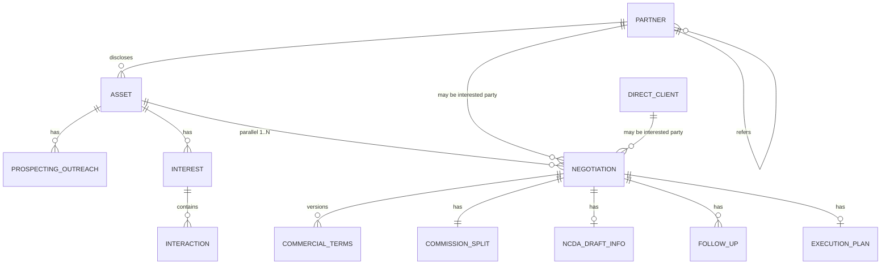

# Domain Model (finfor)

Canonical entity definitions for the intermediation platform. Update when domain rules or persistence design changes.

Related: `spec/08-product-requirements.md`, `spec/10-deal-state-machine.md`, `spec/12-glossary.md`.

## 1) Overview

The domain is **asset-centric**:

- An **Asset** represents a negotiable credit instrument or similar right.
- **Partners** and **DirectClients** are counterparties (not MVP app users).
- **Prospecting** and **interest** attach to the asset.
- **Negotiations** are parallel per asset, each consuming partial capacity.
- **Commercial terms**, **commission splits**, and **NCDA draft data** attach to a negotiation.



## 2) Enumerations

### AssetType

| Code | Label (pt-BR) |
|------|---------------|
| `CREDIT_RIGHT` | Direito creditório |
| `PRECATORY` | Precatório |
| `ICMS_EXPORT` | ICMS de exportação |
| `IPI_CREDIT` | Crédito de IPI |
| `OTHER` | Outro |

### CapacityUnit

| Code | Description |
|------|-------------|
| `BRL` | Monetary capacity in Brazilian Real |
| `PERCENTAGE` | Capacity as percentage of asset (0–100) |

### OfficeRole

Role of the intermediary office in a **negotiation** (not the asset).

| Code | Label (pt-BR) |
|------|---------------|
| `SELL` | Posição de venda |
| `BUY` | Posição de compra |
| `INTERMEDIATE` | Apenas intermediador |

Changing `officeRole` on an in-flight negotiation is **not allowed** — create a **new negotiation** instead (BR-22).

### PartnerSourceType

| Code | Label (pt-BR) | Required fields |
|------|---------------|-----------------|
| `DIRECT` | Cadastro direto pelo escritório | — |
| `PARTNER_REFERRAL` | Indicado por parceiro | `referredByPartnerId` |
| `OTHER` | Outro | `sourceNotes` |

### PartyType

| Code | Description |
|------|-------------|
| `PARTNER` | Registered partner |
| `DIRECT_CLIENT` | Registered direct client |

Used on prospecting, interest, and negotiations.

### InterestStatus

| Code | Description |
|------|-------------|
| `ACTIVE` | Interest still relevant |
| `WITHDRAWN` | Party withdrew interest |
| `CONVERTED` | Converted to formal negotiation |

### InteractionType

| Code | Label (pt-BR) |
|------|---------------|
| `QUESTION` | Pergunta |
| `ANSWER` | Resposta |
| `PROPOSAL` | Proposta |
| `NOTE` | Observação |

### AllocationStatus

| Code | Counts against capacity | Description |
|------|-------------------------|-------------|
| `DRAFT` | No | Negotiation created; no reservation |
| `RESERVED` | Yes | From COMMERCIAL_PROPOSAL onward until released |
| `CONFIRMED` | Yes | From CONDITIONS_ACCEPTANCE |
| `RELEASED` | No | Negotiation lost, archived, or cancelled |

### CancellationReasonCategory

**Required** when cancelling (`BR-29`, `BR-30`). **`cancellationReason`** (free text) is always required; when category is `OTHER`, text must be at least 20 characters.

Complete taxonomy (Option B — 19 categories + `OTHER`):

#### A — Interested party (partner or direct client)

| Code | Label (pt-BR) | Typical scenario |
|------|---------------|------------------|
| `INTERESTED_PARTY_WITHDREW` | Parte interessada desistiu | Partner or direct client abandons after interest or proposal |
| `INTERESTED_PARTY_UNRESPONSIVE` | Parte interessada sem retorno | Follow-ups exhausted; parallel WhatsApp thread went cold |
| `INTERESTED_PARTY_FOUND_ALTERNATIVE` | Parte encontrou outra oportunidade | Party closed a similar deal elsewhere |

#### B — Commercial terms

| Code | Label (pt-BR) | Typical scenario |
|------|---------------|------------------|
| `COMMERCIAL_TERMS_NOT_AGREED` | Condições comerciais não acordadas | Deságio on gross value does not close; parallel proposals incompatible |
| `PROPOSAL_EXPIRED` | Proposta expirada | `CommercialTerms.validUntil` passed without acceptance |
| `OFFICE_ROLE_CHANGED` | Papel do escritório alterado | Office role would change (sell/buy/intermediate) — requires new negotiation (BR-22) |

#### C — Commission

| Code | Label (pt-BR) | Typical scenario |
|------|---------------|------------------|
| `COMMISSION_SPLIT_NOT_AGREED` | Split de comissão não acordado | Office + partners cannot agree on % or amounts |
| `REFERRAL_COMMISSION_DISPUTE` | Disputa sobre comissão de indicação | Referring partner disputes split with disclosing partner or office |

#### D — Asset

| Code | Label (pt-BR) | Typical scenario |
|------|---------------|------------------|
| `ASSET_UNAVAILABLE` | Ativo indisponível | Asset withdrawn, already sold externally, or no longer on the desk |
| `ASSET_DUE_DILIGENCE_FAILED` | Due diligence do ativo reprovada | Process number, ICMS/IPI period, title, or enforceability issue |
| `DISCLOSING_PARTNER_WITHDREW_ASSET` | Parceiro divulgador retirou o ativo | Disclosing partner removes asset from the desk |
| `TRANCHE_STRUCTURE_NOT_VIABLE` | Estrutura de tranches inviável | ICMS-style recurring tranches cannot be structured as needed |

#### E — Parallel negotiations and allocation

| Code | Label (pt-BR) | Typical scenario |
|------|---------------|------------------|
| `SUPERSEDED_BY_OTHER_NEGOTIATION` | Substituída por outra negociação no mesmo ativo | Another parallel negotiation on the same asset prevails |
| `PARTIAL_ALLOCATION_RESTRUCTURED` | Realocação de capacidade do ativo | Desk cancels one slice to restructure partial allocations |

#### F — Formalization and legal

| Code | Label (pt-BR) | Typical scenario |
|------|---------------|------------------|
| `NCDA_FORMATION_BLOCKED` | Impeditivo na formação do NCDA | Assignor, assignee, intermediaries, comarca, or case-specific contract set blocked |
| `REGULATORY_OR_LEGAL_IMPEDIMENT` | Impeditivo legal ou regulatório | LGPD, Brazilian court/jurisdiction issue, non-circumvention concern |
| `DOCUMENTATION_INCOMPLETE` | Documentação insuficiente | Required document exchange cannot complete in time |

#### G — Desk operations

| Code | Label (pt-BR) | Typical scenario |
|------|---------------|------------------|
| `DUPLICATE_OR_ERRONEOUS_ENTRY` | Cadastro duplicado ou erro operacional | Duplicate negotiation from fragmented WhatsApp tracking |
| `CONFIDENTIALITY_CONCERN` | Risco de confidencialidade | Undue exposure of asset origin or disclosing partner |
| `OTHER` | Outro | Case not covered above — **extended text required** (min 20 chars) |

### CommissionSplitLineType

| Code | Description |
|------|-------------|
| `OFFICE` | Intermediary office share |
| `PARTNER` | Partner share (includes disclosing or referring partner) |

### CommissionValueType

| Code | Description |
|------|-------------|
| `PERCENTAGE` | Percentage of agreed commission base |
| `FIXED_AMOUNT` | Fixed BRL amount |

### ExecutionPlanType

| Code | Description |
|------|-------------|
| `SINGLE` | One execution event |
| `RECURRING` | Periodic execution (e.g. monthly ICMS tranches) |

### ConfidentialityLevel

| Code | Description |
|------|-------------|
| `STANDARD` | Default internal visibility |
| `RESTRICTED` | Hides asset origin and disclosing partner from non-privileged roles |

## 3) Entities

### 3.1 User (internal)

| Field | Type | Required | Notes |
|-------|------|----------|-------|
| id | uuid | yes | |
| name | string | yes | |
| email | string | yes | Unique |
| role | UserRole | yes | See `spec/11-permissions-matrix.md` |
| createdAt | datetime | yes | |
| updatedAt | datetime | yes | |

### 3.2 Partner

| Field | Type | Required | Notes |
|-------|------|----------|-------|
| id | uuid | yes | |
| name | string | yes | |
| phone | string | yes | |
| email | string | yes | |
| sourceType | PartnerSourceType | yes | BR-17 |
| referredByPartnerId | uuid | conditional | Required if PARTNER_REFERRAL; immutable after create (BR-20) |
| referredAt | date | no | |
| sourceNotes | string | conditional | Required if OTHER |
| trustScore | integer | yes | Manual trust rating **1–5** (default **3** for new partners); see §4.2 |
| trustScoreUpdatedAt | datetime | no | Last trust update |
| trustScoreUpdatedByUserId | uuid | no | Who last updated trust |
| createdAt | datetime | yes | |
| updatedAt | datetime | yes | |

**Relations:**

- `referredByPartnerId` → Partner (referrer)
- Inverse: partners referred by this partner

**Business rules:** BR-17, BR-18, BR-19, BR-20, BR-21

### 3.3 DirectClient

| Field | Type | Required | Notes |
|-------|------|----------|-------|
| id | uuid | yes | |
| name | string | yes | |
| phone | string | yes | |
| email | string | yes | |
| assetNeed | string | yes | Free text or structured enum later |
| createdAt | datetime | yes | |
| updatedAt | datetime | yes | |

### 3.4 Asset

| Field | Type | Required | Notes |
|-------|------|----------|-------|
| id | uuid | yes | |
| code | string | no | Human-readable desk reference |
| type | AssetType | yes | |
| description | string | no | |
| grossValue | decimal | yes | **Valor bruto** — base for deságio |
| capacityUnit | CapacityUnit | yes | BRL or PERCENTAGE |
| totalCapacity | decimal | yes | Negotiable capacity (may equal grossValue when unit is BRL) |
| allocatedCapacity | decimal | derived | Sum of RESERVED + CONFIRMED allocations |
| remainingCapacity | decimal | derived | totalCapacity − allocatedCapacity |
| disclosingPartnerId | uuid | yes | Partner who brought/disclosed the asset — **confidential** |
| confidentialityLevel | ConfidentialityLevel | yes | Default RESTRICTED for origin fields |
| status | AssetStatus | yes | ACTIVE, FULLY_ALLOCATED, ARCHIVED |
| metadata | AssetMetadata | yes | Type-specific fields (§ 3.4.1) |
| createdAt | datetime | yes | |
| updatedAt | datetime | yes | |

#### 3.4.1 AssetMetadata (type-specific)

Stored as structured JSON validated by Zod per `AssetType`.

| AssetType | Field | Type | Required | Label (pt-BR) |
|-----------|-------|------|----------|---------------|
| `PRECATORY` | processNumber | string | yes | Número do processo |
| `PRECATORY` | court | string | no | Tribunal / vara |
| `PRECATORY` | precatoryNumber | string | no | Número do precatório |
| `ICMS_EXPORT` | taxPeriod | string | yes | Período de referência |
| `ICMS_EXPORT` | state | string | yes | UF |
| `ICMS_EXPORT` | registrationNumber | string | no | Registro / protocolo |
| `IPI_CREDIT` | taxPeriod | string | yes | Período de referência |
| `IPI_CREDIT` | registrationNumber | string | no | Registro |
| `CREDIT_RIGHT` | originDescription | string | yes | Descrição da origem do crédito |
| `CREDIT_RIGHT` | referenceNumber | string | no | Número de referência |
| `OTHER` | identificationNotes | string | yes | Identificação do ativo |

**Confidentiality (BR-27):** `disclosingPartnerId`, `metadata.originDescription`, and any field identifying asset origin or the partner who disclosed the asset are **restricted fields**. See § 7.

#### 3.4.2 Asset capacity example (ICMS tranches)

An ICMS export asset with gross value R$ 1,000,000 may be executed in monthly tranches of R$ 100,000:

- `totalCapacity` = 1,000,000 (BRL) or 100 (%)
- Multiple negotiations may allocate portions (e.g. 200k + 150k + …)
- `ExecutionPlan` on each negotiation defines tranche schedule (§ 3.12)

When `remainingCapacity` = 0 → `status` = FULLY_ALLOCATED; new negotiations blocked (BR-14).

### 3.5 ProspectingOutreach

Records which parties were contacted about an asset.

Partners eligible for outreach on an asset are **ranked** by prospecting score (§4) before contact. UI shows score breakdown on the asset prospecting tab.

| Field | Type | Required | Notes |
|-------|------|----------|-------|
| id | uuid | yes | |
| assetId | uuid | yes | |
| partyId | uuid | yes | Partner or DirectClient id |
| partyType | PartyType | yes | |
| sentAt | datetime | yes | |
| channel | string | no | e.g. WhatsApp, phone, email, meeting |
| notes | string | no | |
| createdByUserId | uuid | yes | |
| createdAt | datetime | yes | |

### 3.6 Interest

Party-level interest on an asset (pre-negotiation).

| Field | Type | Required | Notes |
|-------|------|----------|-------|
| id | uuid | yes | |
| assetId | uuid | yes | |
| partyId | uuid | yes | |
| partyType | PartyType | yes | |
| expressedAt | datetime | yes | |
| status | InterestStatus | yes | |
| notes | string | no | |
| createdAt | datetime | yes | |
| updatedAt | datetime | yes | |

### 3.7 Interaction

Timeline entries under an interest record.

| Field | Type | Required | Notes |
|-------|------|----------|-------|
| id | uuid | yes | |
| interestId | uuid | yes | |
| type | InteractionType | yes | |
| content | text | yes | Question, proposal text, etc. |
| occurredAt | datetime | yes | |
| createdByUserId | uuid | yes | |
| createdAt | datetime | yes | |

Multiple **parallel proposals** from different parties are tracked as separate interest records and/or separate negotiations (BR-11, BR-23).

### 3.8 Negotiation

Formal deal thread for one interested party on one asset.

| Field | Type | Required | Notes |
|-------|------|----------|-------|
| id | uuid | yes | |
| assetId | uuid | yes | |
| interestedPartyId | uuid | yes | Partner or DirectClient |
| partyType | PartyType | yes | |
| officeRole | OfficeRole | yes | Immutable — new negotiation if role changes (BR-22) |
| allocatedAmount | decimal | yes | Portion of asset capacity consumed |
| allocationStatus | AllocationStatus | yes | |
| currentState | NegotiationState | yes | See `spec/10` |
| ownerUserId | uuid | yes | Deal owner |
| priority | enum | no | LOW, NORMAL, HIGH |
| lostReason | string | no | If terminal LOST |
| archivedReason | string | no | If terminal ARCHIVED |
| cancellationReason | text | conditional | **Required** if terminal CANCELLED |
| cancellationReasonCategory | CancellationReasonCategory | conditional | **Required** if CANCELLED (BR-30) |
| cancelledAt | datetime | conditional | Required if CANCELLED |
| cancelledByUserId | uuid | conditional | Required if CANCELLED |
| createdAt | datetime | yes | |
| updatedAt | datetime | yes | |

**Constraints:**

- Sum of active allocations (RESERVED + CONFIRMED) across non-terminal negotiations ≤ asset.totalCapacity (BR-13)
- Cannot create negotiation when asset.remainingCapacity = 0 (BR-14)
- One interested party may have multiple negotiations on same asset only if prior ones are terminal and capacity allows (edge case — prefer one active negotiation per party per asset)

### 3.9 CommercialTerms (versioned)

| Field | Type | Required | Notes |
|-------|------|----------|-------|
| id | uuid | yes | |
| negotiationId | uuid | yes | |
| version | integer | yes | Monotonic per negotiation |
| assetValue | decimal | yes | Gross value reference for this proposal (valor bruto) |
| desagioRate | decimal | no | Rate applied to **gross** value (0–1 or 0–100 per convention) |
| discountValue | decimal | no | Explicit discount amount in BRL |
| netValue | decimal | derived | See § 4 |
| validUntil | date | no | Proposal expiry |
| proposedByPartyId | uuid | no | |
| notes | string | no | |
| createdByUserId | uuid | yes | |
| createdAt | datetime | yes | |

Versions are immutable once saved; edits create a new version (BR-03).

### 3.10 CommissionSplit

Commission is **always split** between the office and one or more partners (BR-24).

| Field | Type | Required | Notes |
|-------|------|----------|-------|
| id | uuid | yes | |
| negotiationId | uuid | yes | One active split per negotiation |
| status | enum | yes | PROPOSED, AGREED |
| commissionBase | decimal | no | Base amount for percentage lines |
| lines | CommissionSplitLine[] | yes | Min: 1 OFFICE + ≥1 PARTNER |
| agreedAt | datetime | no | |
| agreedByUserId | uuid | no | Manager approval |
| createdAt | datetime | yes | |
| updatedAt | datetime | yes | |

#### CommissionSplitLine

| Field | Type | Required | Notes |
|-------|------|----------|-------|
| lineType | CommissionSplitLineType | yes | OFFICE or PARTNER |
| partnerId | uuid | conditional | Required when lineType = PARTNER |
| valueType | CommissionValueType | yes | PERCENTAGE or FIXED_AMOUNT |
| value | decimal | yes | Percentage (0–100) or BRL amount |
| label | string | no | e.g. "Disclosing partner", "Referrer" |

**Validation (BR-25):**

- At least one OFFICE line and at least one PARTNER line
- If all lines are PERCENTAGE, sum must equal 100%
- FIXED_AMOUNT lines must specify currency BRL
- Cannot set status to AGREED without Manager role (configurable)

### 3.11 NcdaDraftInfo

Data to forge NCDA contracts (intermediation + non-disclosure + non-circumvention). MVP stores **draft fields only**, not generated PDFs.

| Field | Type | Required | Notes |
|-------|------|----------|-------|
| id | uuid | yes | |
| negotiationId | uuid | yes | |
| assignor | PartySnapshot | yes | **Cedente** — name, document (CPF/CNPJ), address |
| assignee | PartySnapshot | yes | **Cessionário** |
| intermediaries | PartySnapshot[] | yes | Intermediary office + partners involved |
| commercialSummary | text | yes | Snapshot of agreed commercial terms |
| commissionSummary | text | yes | Snapshot of agreed commission split |
| comarca | string | yes | Court district / jurisdiction |
| contractTypesRequired | string[] | no | Case-dependent: intermediation, NDA, non-circumvention (BR-26) |
| specialClauses | text | no | |
| updatedByUserId | uuid | yes | |
| updatedAt | datetime | yes | |

#### PartySnapshot

| Field | Type | Required |
|-------|------|----------|
| name | string | yes |
| document | string | yes |
| documentType | enum | yes | CPF, CNPJ |
| address | string | no |
| partyId | uuid | no | Link to Partner/DirectClient if applicable |
| partyType | PartyType | no |

### 3.12 FollowUp

| Field | Type | Required | Notes |
|-------|------|----------|-------|
| id | uuid | yes | |
| negotiationId | uuid | yes | |
| dueAt | datetime | yes | |
| completedAt | datetime | no | |
| notes | string | no | |
| assigneeUserId | uuid | yes | |
| createdByUserId | uuid | yes | |
| createdAt | datetime | yes | |

### 3.13 ExecutionPlan

Supports single execution or **recurring tranched** execution (e.g. ICMS monthly tranches).

| Field | Type | Required | Notes |
|-------|------|----------|-------|
| id | uuid | yes | |
| negotiationId | uuid | yes | |
| type | ExecutionPlanType | yes | SINGLE or RECURRING |
| tranches | ExecutionTranche[] | conditional | Required when RECURRING |
| singleAmount | decimal | conditional | Required when SINGLE |
| scheduledAt | datetime | conditional | Required when SINGLE |
| status | enum | yes | PLANNED, IN_PROGRESS, COMPLETED, CANCELLED |
| createdAt | datetime | yes | |
| updatedAt | datetime | yes | |

#### ExecutionTranche

| Field | Type | Required | Notes |
|-------|------|----------|-------|
| sequence | integer | yes | 1-based |
| amount | decimal | yes | e.g. R$ 100,000 |
| scheduledAt | datetime | yes | e.g. monthly |
| status | enum | yes | PLANNED, COMPLETED, CANCELLED |
| completedAt | datetime | no | |

MVP: capture plan structure; full scheduler UI may ship in Phase 1.1.

### 3.14 StateTransition (audit)

| Field | Type | Required |
|-------|------|----------|
| id | uuid |
| negotiationId | uuid |
| fromState | NegotiationState |
| toState | NegotiationState |
| triggeredByUserId | uuid |
| reason | string | no |
| timestamp | datetime |

## 4) Partner prospecting score

When selecting partners to prospect for an **asset**, the system ranks partners by a **contextual score** (0–100) derived from three pillars aligned to desk criteria:

1. **Prior completed business** — track record of executions with the partner
2. **Trust** — manual confidence rating maintained by the desk
3. **Favorable commercial proposals** — quality of past commercial terms in negotiations

Scores are computed **per asset context**: scoped to the asset's `AssetType` and, when enough data exists, weighted toward the current asset's `officeRole` mix on similar deals.

### 4.1 Composite formula

```
prospectingScore = round(
  W_H × historyScore
+ W_T × trustScoreNormalized
+ W_C × commercialScore
+ affinityBonus
)
```

| Symbol | Default | Range | Description |
|--------|---------|-------|-------------|
| `prospectingScore` | — | 0–100 | Final rank for the asset |
| `W_H` | **0.35** | — | Weight: prior completed business |
| `W_T` | **0.25** | — | Weight: trust |
| `W_C` | **0.40** | — | Weight: favorable commercial proposals |
| `affinityBonus` | 0–10 | — | Same `AssetType` execution history (§4.1.4) |

Weights sum to **1.0** on the three pillars; `affinityBonus` is additive capped at **10** (final score capped at **100**).

**Rationale:** commercial proposal quality is weighted highest because it most directly predicts success on a new asset of the same type; history validates reliability; trust captures relationship factors not visible in data.

Managers may override default weights per `AssetType` in a future settings module; MVP uses defaults above.

### 4.1.1 History score (`historyScore`, 0–100)

Based on negotiations where the partner was `interestedPartyId` and `partyType = PARTNER`.

| Sub-metric | Weight within pillar | Calculation |
|------------|---------------------|-------------|
| Execution count | 40% | Count negotiations that reached `EXECUTION` (completed) for this `AssetType` |
| Execution volume | 30% | Sum of `allocatedAmount` at execution, same type; normalized 0–100 vs desk percentile |
| Success rate | 20% | `executions / (executions + LOST + CANCELLED)` as interested party; same `AssetType` |
| Recency | 10% | Exponential decay on days since last execution: `100 × e^(-days/365)` |

If no historical negotiations exist for the partner on this `AssetType`, `historyScore = 40` (neutral-cold baseline).

```
historyScore = 0.40 × norm(executionCount)
             + 0.30 × norm(executionVolume)
             + 0.20 × successRate × 100
             + 0.10 × recencyScore
```

`norm(x)` maps desk distribution to 0–100 (min-max or percentile within asset type). MVP: use fixed tiers (0→0, 1→40, 2–3→60, 4–5→80, 6+→100) for count; volume tiers by BRL bands.

### 4.1.2 Trust score (`trustScoreNormalized`, 0–100)

Manual field on `Partner.trustScore` (integer **1–5**):

| trustScore | trustScoreNormalized |
|------------|---------------------|
| 1 | 20 |
| 2 | 40 |
| 3 | 60 |
| 4 | 80 |
| 5 | 100 |

**Behavioral adjustment** (automatic, optional in MVP):

| Signal | Adjustment |
|--------|--------------|
| ≥2 cancellations as interested party with `INTERESTED_PARTY_UNRESPONSIVE` in last 12 months | −10 |
| ≥1 execution in last 6 months (any type) | +5 |

Adjusted value clamped to 0–100. MVP may ship manual-only first; adjustments in Phase 1.1.

Only `MANAGER` and `ADMIN` may change `trustScore` (see `spec/11`). Changes are audited.

### 4.1.3 Commercial score (`commercialScore`, 0–100)

Reflects how **favorable** the partner's commercial proposals were in past negotiations for the same `AssetType`.

**Favorable** = proposals that advanced the deal toward closure with terms acceptable to the desk (reached `COMMISSION_NEGOTIATION` or beyond, or led to `EXECUTION`).

| Sub-metric | Weight within pillar | Calculation |
|------------|---------------------|-------------|
| Proposal advance rate | 50% | % of partner's `CommercialTerms` versions where negotiation reached `COMMISSION_NEGOTIATION`+ |
| Executed terms quality | 30% | For executions: partner's agreed `desagioRate` vs desk median for successful deals on same type (closer to median successful band = higher) |
| Time to favorable proposal | 20% | Median days from negotiation open to first `COMMERCIAL_PROPOSAL`; faster = higher (cap at 30 days = 100) |

If partner has no commercial history on this `AssetType`, `commercialScore = 40` (neutral-cold).

**Executed terms quality detail:**

- Compute desk **success median** `desagioRate` per `AssetType` from completed negotiations.
- Partner score: `100 − min(100, |partnerMedianDesagio − deskSuccessMedian| × k)` where `k` calibrates sensitivity (default `k = 200` for rate fractions).

### 4.1.4 Asset-type affinity bonus (`affinityBonus`, 0–10)

| Condition | Bonus |
|-----------|-------|
| ≥1 execution on same `AssetType` as target asset | +5 |
| ≥3 executions on same `AssetType` | +8 |
| ≥1 execution on same `AssetType` in last 12 months | +2 (stacking, max 10 total) |

### 4.2 Rank tiers (UI)

| Tier | Score | Label (pt-BR) | Prospecting guidance |
|------|-------|---------------|----------------------|
| `PREFERRED` | 80–100 | Preferido | Contact first |
| `RECOMMENDED` | 60–79 | Recomendado | Strong candidate |
| `NEUTRAL` | 40–59 | Neutro | Contact if capacity allows |
| `LOW_PRIORITY` | 0–39 | Baixa prioridade | Contact only after higher tiers |

On `/assets/[id]/prospecting`, partners not yet in `ProspectingOutreach` are listed **sorted by `prospectingScore` descending** with tier badge and pillar breakdown tooltip.

### 4.3 Cold-start partners

New partners (`trustScore = 3`, no history):

```
prospectingScore ≈ 0.35×40 + 0.25×60 + 0.40×40 = 46  → NEUTRAL
```

Referral from a `PREFERRED` partner may add +5 manual boost (future rule); MVP: no boost.

### 4.4 Worked example

Asset: `ICMS_EXPORT`, R$ 1M. Partner **Alpha**:

| Pillar | Inputs | Sub-score |
|--------|--------|-----------|
| History | 2 executions, R$ 800k total, 67% success, last exec 4 months ago | 72 |
| Trust | trustScore = 4 | 80 |
| Commercial | 80% advance rate, deságio near median, 5 days to proposal | 85 |
| Affinity | 2 ICMS executions | +5 bonus |

```
score = 0.35×72 + 0.25×80 + 0.40×85 + 5
      = 25.2 + 20 + 34 + 5
      = 84.2 → 84 → PREFERRED
```

Partner **Beta** (new, trust 3, no ICMS history): score ≈ **46** → NEUTRAL — Alpha ranks higher.

### 4.5 Derived artifact (implementation)

| Field | Storage | Notes |
|-------|---------|-------|
| `prospectingScore` | computed | Not persisted; recalculated on read or nightly cache |
| `scoreBreakdown` | computed JSON | `{ history, trust, commercial, affinity, weights }` for UI |
| `prospectRankTier` | computed enum | `PREFERRED` \| `RECOMMENDED` \| `NEUTRAL` \| `LOW_PRIORITY` |

Optional cache table `PartnerProspectScoreCache(partnerId, assetType, score, computedAt)` for performance in Phase 1.1.

## 5) Commercial calculations

### 5.1 Deságio on gross value (BR-02)

`desagioRate` always applies to **gross asset value** (`assetValue` / valor bruto).

Convention: store rate as decimal fraction (e.g. 0.15 = 15%).

```
desagioAmount = assetValue × desagioRate
```

### 5.2 Net value

When `desagioRate` is provided:

```
netValue = assetValue − desagioAmount
```

When only `discountValue` is provided (no rate):

```
netValue = assetValue − discountValue
```

When **both** are provided, **desagioRate on gross takes precedence**; `discountValue` is stored for reference but does not override the calculated net value unless explicitly flagged in a future enhancement.

### 5.3 Allocation in BRL vs percentage

When `capacityUnit = BRL`:

- `allocatedAmount` is in BRL
- `remainingCapacity = totalCapacity − sum(active allocatedAmount)`

When `capacityUnit = PERCENTAGE`:

- `allocatedAmount` is 0–100
- Same summation rules apply

## 6) Business rules index

| ID | Rule |
|----|------|
| BR-01 | Every asset must have a disclosing partner |
| BR-02 | desagioRate applies to gross asset value |
| BR-03 | Commercial terms are versioned; no overwrite |
| BR-11 | An asset may have N parallel negotiations |
| BR-12 | allocatedAmount > 0 required before leaving INTEREST_SPECULATION |
| BR-13 | Sum of RESERVED + CONFIRMED allocations ≤ totalCapacity |
| BR-14 | Block new negotiation when remainingCapacity = 0 |
| BR-15 | LOST / ARCHIVED / CANCELLED releases allocation (RELEASED) |
| BR-28 | Negotiation may be **cancelled** only while **formalization is not complete** (states through `CONDITIONS_ACCEPTANCE`; not in `EXECUTION`) |
| BR-29 | Cancellation requires non-empty `cancellationReason`; persist `cancelledAt` and `cancelledByUserId` |
| BR-30 | Cancellation requires `cancellationReasonCategory`; when `OTHER`, `cancellationReason` must be ≥ 20 characters |
| BR-16 | allocatedAmount changes must respect remaining capacity |
| BR-17 | Partner.sourceType required |
| BR-18 | PARTNER_REFERRAL requires referredByPartnerId |
| BR-19 | Partner cannot refer itself |
| BR-20 | referredByPartnerId immutable after create (admin override with audit) |
| BR-22 | officeRole change → new negotiation |
| BR-23 | Multiple parallel proposals tracked per party via interest + negotiations |
| BR-24 | Commission always split: office + partners |
| BR-25 | Commission AGREED requires valid split lines + manager approval |
| BR-26 | NCDA contract types depend on case — not always all three |
| BR-27 | Asset origin and disclosing partner are restricted fields |
| BR-31 | Partner `trustScore` (1–5) required; default 3 on create |
| BR-32 | Prospecting partner list ranked by `prospectingScore` for the asset's type |
| BR-33 | Only MANAGER/ADMIN may update `trustScore` (audited) |
| BR-34 | Default pillar weights: history 0.35, trust 0.25, commercial 0.40 |
| BR-35 | Cold-start partners with no type history use neutral sub-scores (40) on history and commercial pillars |

## 7) Confidentiality (BR-27)

Restricted fields (when `confidentialityLevel = RESTRICTED`):

- `Asset.disclosingPartnerId`
- `Asset.metadata` fields that identify origin (e.g. `originDescription`, process identifiers tied to holder)
- Any computed display of "who brought this asset"

Roles that may view restricted fields: `ADMIN`, `MANAGER`, and negotiation `ownerUserId`. See `spec/11-permissions-matrix.md`.

Post-MVP portfolio search must **never** expose restricted fields.

## 8) Revision history

| Date | Author | Summary |
|------|--------|---------|
| 2026-06-14 | Product | Initial domain model — parallel negotiations, allocation, commission splits, NCDA, tranches |
| 2026-06-15 | Product | Cancellation before formalization complete; cancellationReason required |
| 2026-06-15 | Product | Complete cancellation taxonomy (Option B — 19 categories + OTHER); category required |
| 2026-06-15 | Product | Partner prospecting score — history, trust, commercial pillars |
