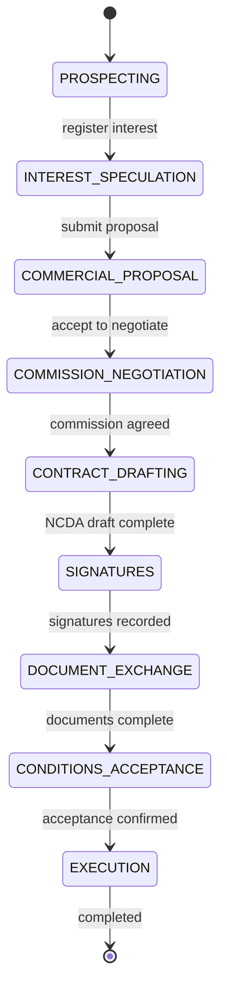

# Deal State Machine (finfor)

Negotiation lifecycle states, transitions, preconditions, and allocation side effects.

Related: `spec/09-domain-model.md`, `spec/08-product-requirements.md`.

## 1) Scope

This state machine applies to the **Negotiation** entity, not the Asset.

- One asset may have **many parallel negotiations**, each in its own state.
- **Prospecting** and **interest** are asset-level activities outside this machine until a negotiation is created.
- Terminal states: `EXECUTION` (completed), `LOST`, `ARCHIVED`, `CANCELLED`.
- **Formalization** spans `CONTRACT_DRAFTING` → `SIGNATURES` → `DOCUMENT_EXCHANGE` → `CONDITIONS_ACCEPTANCE`. Formalization is **complete** when the negotiation enters `EXECUTION`.

## 2) States

| Order | Label (pt-BR) | Code | Description |
|-------|---------------|------|-------------|
| 1 | Prospecção | `PROSPECTING` | Negotiation opened; asset outreach may still be in progress |
| 2 | Interesse/Especulação | `INTEREST_SPECULATION` | Interested party identified; exploratory stage |
| 3 | Proposta comercial do interessado | `COMMERCIAL_PROPOSAL` | Formal commercial proposal on record — **allocation reserved** |
| 4 | Negociação das comissões | `COMMISSION_NEGOTIATION` | Commission split under discussion |
| 5 | Contrato de intermediação, NDA e não circunvenção | `CONTRACT_DRAFTING` | NCDA draft data being prepared |
| 6 | Assinaturas | `SIGNATURES` | Signatures in progress (manual tracking in MVP) |
| 7 | Trocas de documentos | `DOCUMENT_EXCHANGE` | Document exchange (manual / Phase 1.1) |
| 8 | Aceite das condições | `CONDITIONS_ACCEPTANCE` | Final acceptance — allocation **confirmed** |
| 9 | Execução | `EXECUTION` | Single or recurring / tranched execution |

### Terminal and exceptional states

| Code | Description |
|------|-------------|
| `LOST` | Negotiation closed unsuccessfully; allocation **released** |
| `ARCHIVED` | Negotiation archived; allocation **released** |
| `CANCELLED` | Negotiation cancelled before formalization completed; allocation **released**; **cancellationReason required** (BR-28, BR-29) |

## 3) State diagram (happy path)



## 4) Parallel tracks (signatures vs documents)

In practice, **Signatures** and **Document exchange** may overlap. MVP uses a **linear state sequence** for simplicity, but implementation should support:

| Checklist flag | Set when |
|----------------|----------|
| `contractsSigned` | All required signatures recorded |
| `documentsComplete` | Required document checklist satisfied |
| `conditionsAccepted` | Acceptance recorded |

Advance to `EXECUTION` requires all three flags true, regardless of linear state position (allows future parallel UX).

MVP UI: linear stepper is acceptable if users advance sequentially.

## 5) Allocation side effects

| Event | allocationStatus | Counts against capacity |
|-------|------------------|-------------------------|
| Negotiation created | `DRAFT` | No |
| Enter `COMMERCIAL_PROPOSAL` | `RESERVED` | **Yes** |
| Enter `CONDITIONS_ACCEPTANCE` | `CONFIRMED` | Yes |
| Enter `LOST`, `ARCHIVED`, or `CANCELLED` | `RELEASED` | No |
| `allocatedAmount` increased while RESERVED/CONFIRMED | unchanged status | Re-validated against remaining |

When asset `remainingCapacity` reaches 0 after reservation:

- Asset status → `FULLY_ALLOCATED`
- Block creation of new negotiations (BR-14)

When allocation is released and remaining > 0:

- Asset status → `ACTIVE`

## 6) Transition table

| From | To | Trigger (user action) | Preconditions | Roles |
|------|-----|----------------------|---------------|-------|
| — | `PROSPECTING` | Create negotiation | Asset has remainingCapacity > 0; interested party set; allocatedAmount > 0 | Deal Owner, Manager |
| `PROSPECTING` | `INTEREST_SPECULATION` | Confirm interest | Interest record exists or party confirmed | Deal Owner |
| `INTEREST_SPECULATION` | `COMMERCIAL_PROPOSAL` | Register commercial proposal | CommercialTerms v1 saved; capacity check passes | Deal Owner |
| `COMMERCIAL_PROPOSAL` | `COMMISSION_NEGOTIATION` | Accept proposal for commission talk | Latest CommercialTerms valid | Deal Owner, Manager |
| `COMMERCIAL_PROPOSAL` | `LOST` | Reject proposal | lostReason required | Deal Owner |
| `COMMISSION_NEGOTIATION` | `CONTRACT_DRAFTING` | Commission agreed | CommissionSplit.status = AGREED | Manager |
| `COMMISSION_NEGOTIATION` | `COMMERCIAL_PROPOSAL` | Reopen terms | New CommercialTerms version | Deal Owner, Manager |
| `CONTRACT_DRAFTING` | `SIGNATURES` | NCDA draft complete | NcdaDraftInfo required fields filled | Deal Owner, Legal |
| `SIGNATURES` | `DOCUMENT_EXCHANGE` | Signatures recorded | contractsSigned flag (MVP: manual confirm) | Deal Owner, Legal |
| `DOCUMENT_EXCHANGE` | `CONDITIONS_ACCEPTANCE` | Documents complete | documentsComplete flag (MVP: manual confirm) | Deal Owner |
| `CONDITIONS_ACCEPTANCE` | `EXECUTION` | Confirm execution start | conditionsAccepted; allocation CONFIRMED; ExecutionPlan defined | Manager |
| `PROSPECTING` … `CONDITIONS_ACCEPTANCE` | `CANCELLED` | Cancel negotiation | `cancellationReasonCategory` + `cancellationReason` required (BR-28–30) | Deal Owner, Manager |
| Any non-terminal except `EXECUTION` | `LOST` | Mark lost | lostReason required | Deal Owner, Manager |
| Any non-terminal except `EXECUTION` | `ARCHIVED` | Archive | archivedReason required | Deal Owner, Admin |
| `EXECUTION` | `CANCELLED` | — | **Not allowed** — formalization complete | — |

### Cancellation (BR-28, BR-29)

A negotiation may be **cancelled** at any point **until formalization is complete**:

| Cancellation allowed | Cancellation blocked |
|----------------------|----------------------|
| `PROSPECTING` | `EXECUTION` |
| `INTEREST_SPECULATION` | Terminal states (`LOST`, `ARCHIVED`, `CANCELLED`) |
| `COMMERCIAL_PROPOSAL` | |
| `COMMISSION_NEGOTIATION` | |
| `CONTRACT_DRAFTING` | |
| `SIGNATURES` | |
| `DOCUMENT_EXCHANGE` | |
| `CONDITIONS_ACCEPTANCE` | |

**Required on cancel:**

- `cancellationReasonCategory` — required enum (`spec/09` § CancellationReasonCategory, Option B)
- `cancellationReason` — non-empty text; **minimum 20 characters** when category is `OTHER` (BR-30)
- `cancelledAt`, `cancelledByUserId` — set by the system from the authenticated user

**Suggested categories by current state** (UI may surface these first in the cancel dialog):

| Current state | Suggested categories (first in list) |
|---------------|--------------------------------------|
| `PROSPECTING`, `INTEREST_SPECULATION` | `INTERESTED_PARTY_UNRESPONSIVE`, `INTERESTED_PARTY_WITHDREW`, `DISCLOSING_PARTNER_WITHDREW_ASSET`, `DUPLICATE_OR_ERRONEOUS_ENTRY` |
| `COMMERCIAL_PROPOSAL` | `COMMERCIAL_TERMS_NOT_AGREED`, `PROPOSAL_EXPIRED`, `SUPERSEDED_BY_OTHER_NEGOTIATION`, `PARTIAL_ALLOCATION_RESTRUCTURED` |
| `COMMISSION_NEGOTIATION` | `COMMISSION_SPLIT_NOT_AGREED`, `REFERRAL_COMMISSION_DISPUTE`, `INTERESTED_PARTY_WITHDREW` |
| `CONTRACT_DRAFTING` … `CONDITIONS_ACCEPTANCE` | `NCDA_FORMATION_BLOCKED`, `REGULATORY_OR_LEGAL_IMPEDIMENT`, `DOCUMENTATION_INCOMPLETE`, `ASSET_DUE_DILIGENCE_FAILED` |
| Any (cross-cutting) | `ASSET_UNAVAILABLE`, `TRANCHE_STRUCTURE_NOT_VIABLE`, `OFFICE_ROLE_CHANGED`, `CONFIDENTIALITY_CONCERN`, `INTERESTED_PARTY_FOUND_ALTERNATIVE`, `OTHER` |

Side effects: `allocationStatus` → `RELEASED`; asset `remainingCapacity` recalculated; open follow-ups closed or marked obsolete.

**Distinction from LOST:** `LOST` = commercial outcome failed (e.g. proposal rejected). `CANCELLED` = explicit desk decision to abort the negotiation before formalization completes.

### Backward transitions

Backward moves are **discouraged** but allowed to prior adjacent state with `reason` logged in StateTransition, except:

- Cannot move backward from `EXECUTION`
- Moving back from `COMMERCIAL_PROPOSAL` releases allocation unless still valid at new state

## 7) Preconditions detail

### 7.1 Create negotiation

```
remainingCapacity(asset) >= allocatedAmount
allocatedAmount > 0
interestedPartyId + partyType set
officeRole set
No other ACTIVE negotiation for same asset + same party (recommendation)
```

### 7.2 COMMERCIAL_PROPOSAL

```
CommercialTerms.version >= 1 saved
assetValue (gross) > 0
sum(active allocations on asset) + allocatedAmount <= totalCapacity
allocationStatus → RESERVED
```

### 7.3 COMMISSION_NEGOTIATION → CONTRACT_DRAFTING

```
CommissionSplit.status == AGREED
At least 1 OFFICE line + 1 PARTNER line
Percentage lines sum to 100% OR all lines FIXED_AMOUNT
```

### 7.4 CONTRACT_DRAFTING → SIGNATURES

```
NcdaDraftInfo.assignor filled
NcdaDraftInfo.assignee filled
NcdaDraftInfo.intermediaries.length >= 1
NcdaDraftInfo.commercialSummary filled
NcdaDraftInfo.commissionSummary filled
NcdaDraftInfo.comarca filled
contractTypesRequired: case-dependent, not enforced as fixed set of 3
```

### 7.5 CONDITIONS_ACCEPTANCE → EXECUTION

```
allocationStatus → CONFIRMED
ExecutionPlan defined (SINGLE or RECURRING with tranches)
All checklist flags true
```

## 8) Multiple parallel negotiations (example)

Asset: ICMS export, totalCapacity = R$ 1,000,000 (BRL)

| Negotiation | Party | allocatedAmount | State | Allocation |
|-------------|-------|---------------|-------|------------|
| N-001 | Partner B | R$ 400,000 | COMMISSION_NEGOTIATION | RESERVED |
| N-002 | Partner D | R$ 300,000 | COMMERCIAL_PROPOSAL | RESERVED |
| N-003 | DirectClient E | R$ 300,000 | INTEREST_SPECULATION | DRAFT |

Remaining = R$ 0 after N-002 reserves → new negotiations **blocked**.

N-003 can still advance if already in DRAFT before capacity exhausted; advancing to COMMERCIAL_PROPOSAL would **fail** validation unless N-001 or N-002 releases allocation.

## 9) Execution and tranches

When negotiation enters `EXECUTION`:

| ExecutionPlanType | Behavior |
|-------------------|----------|
| `SINGLE` | One scheduled execution event |
| `RECURRING` | Ordered tranches (e.g. R$ 100k × 10 months for ICMS) |

Tranche completion is tracked per `ExecutionTranche.status`. MVP may record plan without automated reminders.

## 10) Audit requirements

Every transition must persist:

- `fromState`, `toState`
- `triggeredByUserId`
- `timestamp`
- optional `reason`

Allocation status changes must be logged in the same audit stream or a dedicated allocation audit table.

## 11) Implementation notes

| Layer | Responsibility |
|-------|----------------|
| Domain service | Validate preconditions; compute capacity; mutate allocationStatus |
| API handler | Map HTTP errors for blocked transitions |
| Unit tests | Every transition + capacity edge case (mandatory per `spec/07`) |
| Frontend | State stepper on `/negotiations/[id]`; disable actions when preconditions fail |

Forbidden:

- Controllers must not implement transition rules directly (`spec/05` layering).
- UI must not allow transition without server validation.

## 12) Revision history

| Date | Author | Summary |
|------|--------|---------|
| 2026-06-14 | Product | Initial state machine — parallel negotiations, allocation at commercial proposal |
| 2026-06-15 | Product | CANCELLED terminal state; cancel allowed until formalization complete |
| 2026-06-15 | Product | Complete cancellation taxonomy; category required on cancel |
